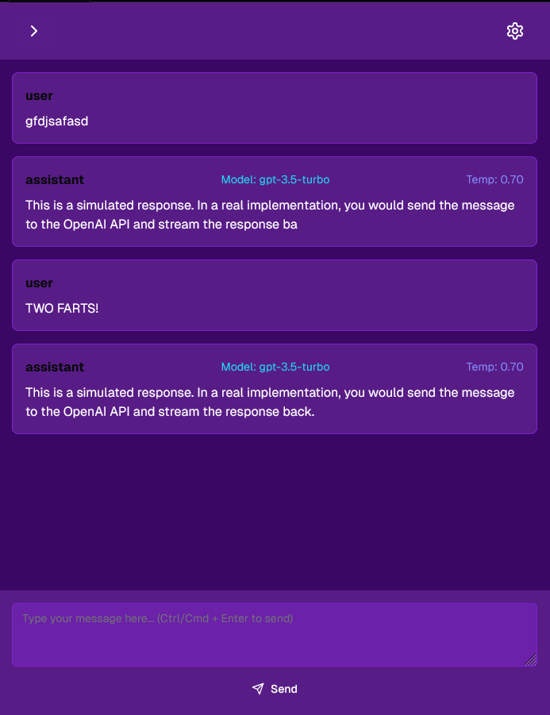
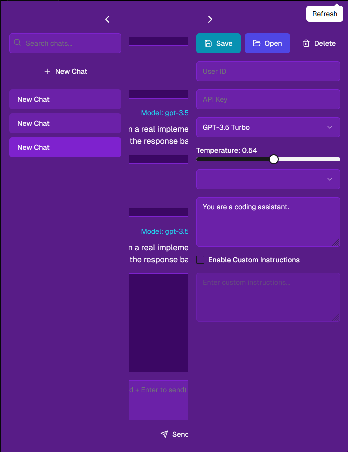

Plan: Taking a crack at it in React this time.

Core:
---
Still need to get it working with the base API key
- need to anonymize that input plz
- also need to get the streaming working

Next:
---
Gotta have that backend server going, I reckon.

New Features:
---
okay, now we need a user-generated prompts dropdown so that users can save custom prompts for later. So:
- a new input above the custom prompt for a name (required for saving!)
- a new "save" button for the custom prompt (if save is used again on the same named prompt, it updates it)
- and a new dropdown above the custom prompts
- a "delete" for the current custom prompt

---
Next, I want a file attachments tray that can handle images, videos, audio, pdf, txt, markdown, etc-- basically media and text, with appropriate previews / icons in the tray. drag and drop functionality, too. it should slide out above the input area when a file is dragged on, or when an attachments button is clicked.

---
Also we get a Monaco editor in there

---
THEN I co-opt their line-by-line code reading concept.

---
npx shadcn@latest add "https://v0.dev/chat/b/b_G3CTJf14z0C?token=eyJhbGciOiJkaXIiLCJlbmMiOiJBMjU2R0NNIn0..HWe7nqWuvb6Fe4nS.WKXswlthHb04oB0znDwejkSPn4AiWOcAKzCDuL0vCMScIgB1eM9zK0ZVfKQ.b_eRlEWC7XywxeJ19qDlEA"

---

